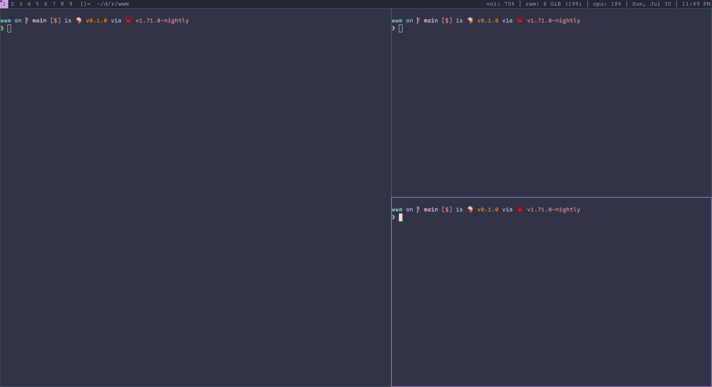

# WWM: Wally's Window Manager
A simple non-reparenting dynamic window manager for X.

## Screenshots
__Tiling layout__:

__Column layout__:

## Configuration
All configuration is done in code in the [src/config.rs](./src/config.rs) file.

## Development
1. On Linux you can enter another session using `Ctrl+Alt+F{3,4,5,...}`.
2. Once in a new session, log into it and go to the project root.
3. Run `RUST_BACKTRACE=full ./run.sh 2&>run.log`
    - This runs `xorg` through `xinit` along with some dummy applications
      followed by the window manager
    - It also logs all the errors and the backtrace to a new file `run.log`
